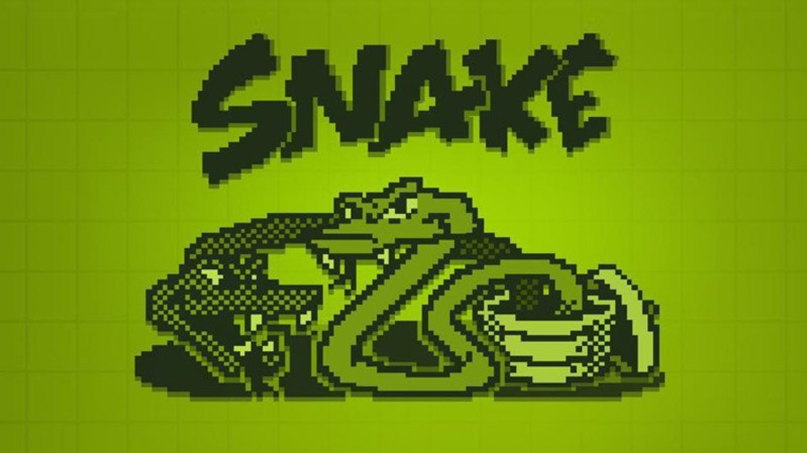
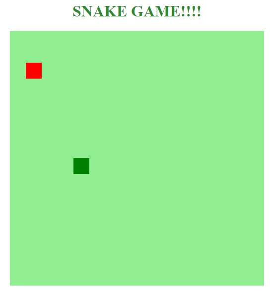

<h1 align="center">
    
</h1>

    <a href="#bookmark-sobre-o-projeto">Sobre</a>&nbsp;&nbsp;&nbsp;|&nbsp;&nbsp;&nbsp;
    <a href="#rocket-tecnologias-utilizadas">Tecnologias</a>

    

## :bookmark: Sobre o Projeto

O **Snake Game** é um projeto feito para praticar ensinamentos adquiridos durante o bootcamp da Dio , o intuito desta aplicação é melhorar os níveis de conhecimento relacionados a **HTML** ,  **CSS** e **Javascript**.

Essa aplicação foi realizada durante bootcamp da Digital Innovation, no dia **01 de Junho**, projeto de **Wendel Campos Aguiar**.

## Tecnologias Utilizadas:

- [Html](https://www.w3schools.com/html/)

- [CSS](https://www.w3schools.com/html/)

- [Javascript](https://www.w3schools.com/html/)

  
